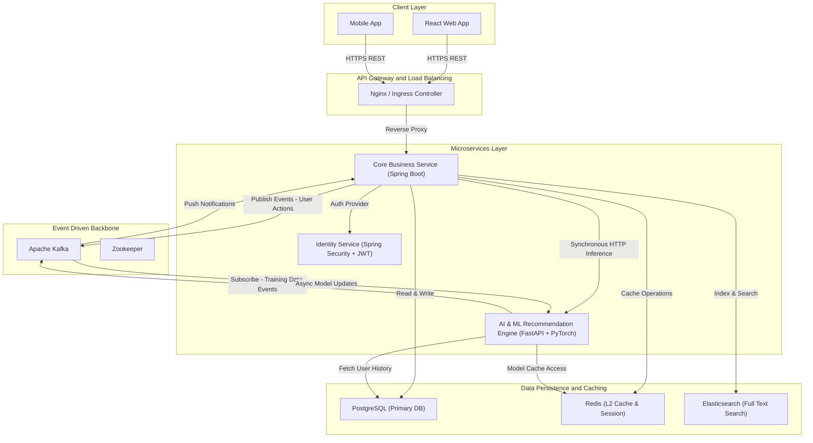

# RecipeShare: Recipe Management System

A comprehensive, full-stack application for managing recipes, featuring social interactions and personalized AI-powered recommendations.

## 📋 Table of Contents

- [Overview](#overview)
- [System Architecture](#system-architecture)
- [Key Features](#key-features)
- [Tech Stack](#tech-stack)
- [Prerequisites](#prerequisites)
- [Getting Started](#getting-started)
  - [Infrastructure Setup](#infrastructure-setup)
  - [Backend Setup](#backend-setup)
  - [ML Backend Setup](#ml-backend-setup)
  - [Frontend Setup](#frontend-setup)
- [API Documentation](#api-documentation)
- [Project Structure](#project-structure)
- [Contributing](#contributing)

## 🔭 Overview

**RecipeShare** is a modern web application designed to transform how users discover and share culinary experiences. It integrates a robust **Java Spring Boot** backend for core business logic, a **Python FastAPI** service for machine learning-based personalized recommendations, and a responsive **React** frontend for an engaging user experience.

## 🏗 System Architecture

The system follows a microservices-inspired architecture, ensuring scalability and separation of concerns.



### Components

- **Frontend (React)**: The user interface for browsing recipes, managing profiles, and interacting with the community.
- **Java Backend (Spring Boot)**: The core application server handling user authentication, recipe CRUD operations, social features, and orchestration.
- **ML Backend (FastAPI)**: A dedicated service that generates personalized recipe recommendations using advanced ML models (Two-Tower Neural Network + ALS).
- **PostgreSQL**: The primary relational database for storing user data, recipes, and interactions.
- **Apache Kafka**: Handles asynchronous event streaming (e.g., user clicks, likes) to trigger model updates and notifications.
- **Redis**: High-performance caching layer for session management and recommendation caching.
- **Elasticsearch**: Powers advanced search capabilities for recipes and ingredients.

## ✨ Key Features

- **User Management**: Secure registration, authentication, and detailed user profiles.
- **Recipe Management**: Create, edit, and delete recipes with support for rich media (images/videos).
- **Social Interactions**: Follow other chefs, like recipes, and comment on posts.
- **Smart Recommendations**: Personalized recipe feeds tailored to user preferences and behavior.
- **Advanced Search**: Find recipes by ingredients, tags, cooking time, or name.
- **Activity Feed**: Stay updated with the latest creations from users you follow.

## 🛠 Tech Stack

### Frontend

- **Framework**: React (Vite)
- **Language**: TypeScript
- **Styling**: Tailwind CSS, Radix UI
- **State Management**: React Query / Context API

### Backend (Core)

- **Framework**: Spring Boot 3.5.6
- **Language**: Java 17
- **Database**: PostgreSQL
- **Search**: Elasticsearch
- **Messaging**: Apache Kafka
- **Caching**: Redis
- **Build Tool**: Maven

### ML Backend

- **Framework**: FastAPI
- **Language**: Python 3.10+
- **ML Libraries**: PyTorch, Scikit-learn, Implicit, Pandas, NumPy
- **Models**: Two-Tower Neural Network, Alternating Least Squares (ALS)
- **Build Tool**: Pip

## 📦 Prerequisites

Ensure you have the following installed:

- **Docker** & **Docker Compose** (Recommended for infrastructure)
- **Java 17** (For running the Java Backend)
- **Node.js 18+** & **pnpm** (For running the Frontend)
- **Python 3.10+** (For running the ML Backend)

## 🚀 Getting Started

### 1. Infrastructure Setup

Start the required infrastructure services (Postgres, Kafka, Redis, Elasticsearch) using Docker Compose.

```bash
# From the project root
docker-compose up -d
```

_Note: This starts the infrastructure containers only. The application services must be run separately._

### 2. Backend Setup (Java)

Navigate to the `javaBackend` directory and start the Spring Boot application.

```bash
cd javaBackend
# Run using Maven wrapper
./mvnw spring-boot:run
```

- **Server Port**: `8090`
- **API Base URL**: `http://localhost:8090/api`

### 3. ML Backend Setup (Python)

Navigate to the `ML_Backend` directory and start the FastAPI service.

```bash
cd ML_Backend

# Create a virtual environment
python -m venv env

# Activate the environment
# Windows:
.\env\Scripts\activate
# Linux/Mac:
source env/bin/activate

# Install dependencies
pip install -r requirements.txt

# Run the application
uvicorn api.main:app --reload --port 8000
```

- **Server Port**: `8000`
- **API Base URL**: `http://localhost:8000`

### 4. Frontend Setup (React)

Navigate to the `Recipe_frontend/recipe_frontend` directory and start the development server.

```bash
cd Recipe_frontend/recipe_frontend

# Install dependencies
pnpm install

# Start development server
pnpm run dev
```

- **App URL**: `http://localhost:5173` (or as configured in console)

## 📡 API Documentation

### Java Backend Endpoints

- `POST /api/auth/register` - Register a new user
- `POST /api/auth/login` - User login
- `GET /api/v1/recipes` - Get all recipes
- `POST /api/v1/recipes` - Create a new recipe
- `GET /api/v1/users/{id}` - Get user profile

### ML Backend Endpoints

- `POST /api/recommendations` - Get personalized recommendations
- `GET /api/health` - Check service health

_For detailed API documentation, refer to the Swagger UI at `http://localhost:8090/swagger-ui.html` (when backend is running)._

## 📂 Project Structure

```
Recipe_Management_System/
├── docker-compose.yml      # Infrastructure orchestration (DB, Kafka, Redis)
├── docs/                   # Project documentation
├── javaBackend/            # Spring Boot Application (Core Logic)
│   ├── src/                # Source code
│   ├── pom.xml             # Maven configuration
│   └── compose.yaml        # Backend-specific docker compose
├── ML_Backend/             # Python FastAPI Service (AI/ML)
│   ├── api/                # API routes and logic
│   ├── models/             # ML models
│   ├── notebooks/          # Jupyter notebooks for training
│   └── requirements.txt    # Python dependencies
└── Recipe_frontend/        # Frontend Application
    └── recipe_frontend/    # React project source
        ├── src/            # Components and pages
        └── package.json    # Node dependencies
```

## 🤝 Contributing

Contributions are welcome! Please feel free to submit a Pull Request.

1. Fork the repository
2. Create your feature branch (`git checkout -b feature/AmazingFeature`)
3. Commit your changes (`git commit -m 'Add some AmazingFeature'`)
4. Push to the branch (`git push origin feature/AmazingFeature`)
5. Open a Pull Request

## 📄 License

This project is licensed under the MIT License.
