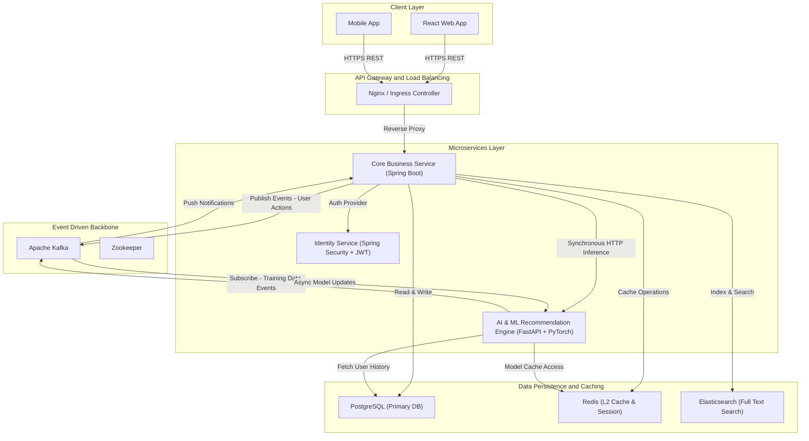

# RecipeShare: Recipe Management System

[](LICENSE)
[](https://spring.io/projects/spring-boot)
[](https://www.java.com/)
[](https://fastapi.tiangolo.com/)
[](https://www.python.org/)
[](https://reactjs.org/)
[](https://www.typescriptlang.org/)
[](https://www.postgresql.org/)
[](https://www.docker.com/)
[](https://pytorch.org/)
[](https://kafka.apache.org/)

A comprehensive, full-stack application for managing recipes, featuring social interactions and personalized AI-powered recommendations.

---

## Project Demo

https://github.com/user-attachments/assets/6ac87e6d-c648-4809-83de-4f2e7759c954

---

## 📋 Table of Contents

- [Overview](#overview)
- [System Architecture](#system-architecture)
- [Key Features](#key-features)
- [Tech Stack](#tech-stack)
- [Prerequisites](#prerequisites)
- [Getting Started](#getting-started)
  - [Infrastructure Setup](#infrastructure-setup)
  - [Backend Setup](#backend-setup)
  - [ML Backend Setup](#ml-backend-setup)
  - [Frontend Setup](#frontend-setup)
- [Model Training](#model-training)
- [API Documentation](#api-documentation)
- [Project Structure](#project-structure)
- [Contributing](#contributing)

---

## 🔭 Overview

**RecipeShare** is a modern web application designed to transform how users discover and share culinary experiences. It integrates a robust **Java Spring Boot** backend for core business logic, a **Python FastAPI** service for machine learning-based personalized recommendations, and a responsive **React** frontend for an engaging user experience.

---

## 🏗 System Architecture

The system follows a microservices-inspired architecture, ensuring scalability and separation of concerns.


---

### Components

- **Frontend (React)**: The user interface for browsing recipes, managing profiles, and interacting with the community.
- **Java Backend (Spring Boot)**: The core application server handling user authentication, recipe CRUD operations, social features, and orchestration.
- **ML Backend (FastAPI)**: A dedicated service that generates personalized recipe recommendations using advanced ML models (Two-Tower Neural Network + ALS).
- **PostgreSQL**: The primary relational database for storing user data, recipes, and interactions.
- **Apache Kafka**: Handles asynchronous event streaming (e.g., user clicks, likes) to trigger model updates and notifications.
- **Redis**: High-performance caching layer for session management and recommendation caching.
- **Elasticsearch**: Powers advanced search capabilities for recipes and ingredients.
---

## ✨ Key Features

- **User Management**: Secure registration, authentication, and detailed user profiles.
- **Recipe Management**: Create, edit, and delete recipes with support for rich media (images/videos).
- **Social Interactions**: Follow other chefs, like recipes, and comment on posts.
- **Smart Recommendations**: Personalized recipe feeds tailored to user preferences and behavior.
- **Advanced Search**: Find recipes by ingredients, tags, cooking time, or name.
- **Activity Feed**: Stay updated with the latest creations from users you follow.

---

## 🛠 Tech Stack

### Frontend

- **Framework**: React (Vite)
- **Language**: TypeScript
- **Styling**: Tailwind CSS, Radix UI
- **State Management**: React Query / Context API

### Backend (Core)

- **Framework**: Spring Boot 3.5.6
- **Language**: Java 17
- **Database**: PostgreSQL
- **Search**: Elasticsearch
- **Messaging**: Apache Kafka
- **Caching**: Redis
- **Build Tool**: Maven

### ML Backend

- **Framework**: FastAPI
- **Language**: Python 3.10+
- **ML Libraries**: PyTorch, Scikit-learn, Implicit, Pandas, NumPy
- **Models**: Two-Tower Neural Network, Alternating Least Squares (ALS)
- **Build Tool**: Pip

---

## 📦 Prerequisites

Ensure you have the following installed:

- **Docker** & **Docker Compose** (Recommended for infrastructure)
- **Java 17** (For running the Java Backend)
- **Node.js 18+** & **pnpm** (For running the Frontend)
- **Python 3.10+** (For running the ML Backend)

## 🚀 Getting Started

### 1. Infrastructure Setup

Start the required infrastructure services (Postgres, Kafka, Redis, Elasticsearch) using Docker Compose.

```bash
# From the project root
docker-compose up -d
```

_Note: This starts the infrastructure containers only. The application services must be run separately._

### 2. Backend Setup (Java)

Navigate to the `javaBackend` directory and start the Spring Boot application.

```bash
cd javaBackend
# Run using Maven wrapper
./mvnw spring-boot:run
```

- **Server Port**: `8090`
- **API Base URL**: `http://localhost:8090/api`

### 3. ML Backend Setup (Python)

Navigate to the `ML_Backend` directory and start the FastAPI service.

```bash
cd ML_Backend

# Create a virtual environment
python -m venv env

# Activate the environment
# Windows:
.\env\Scripts\activate
# Linux/Mac:
source env/bin/activate

# Install dependencies
pip install -r requirements.txt

# Run the application
uvicorn api.main:app --reload --port 8000
```

- **Server Port**: `8000`
- **API Base URL**: `http://localhost:8000`

### 4. Frontend Setup (React)

Navigate to the `Recipe_frontend/recipe_frontend` directory and start the development server.

```bash
cd Recipe_frontend/recipe_frontend

# Install dependencies
pnpm install

# Start development server
pnpm run dev
```

- **App URL**: `http://localhost:5173` (or as configured in console)

---

## 🧠 Model Training & AI Architecture

The recommendation engine is the core of RecipeShare's personalized experience. We employ a hybrid approach combining **Collaborative Filtering** and **Deep Learning** to deliver accurate, diverse, and socially relevant recommendations.

### 1. Alternating Least Squares (ALS)

The **ALS** model serves as our primary collaborative filtering engine, optimized for implicit feedback datasets (views, likes, saves).

- **Library:** `implicit` (GPU-accelerated)
- **Technique:** Matrix Factorization with **BM25 weighting** to handle implicit interaction signals effectively.
- **Hybrid Reranking Strategy:**
  - **Social Boosting:** Recipes interacted with by a user's "followees" receive a relevance boost.
  - **Content Similarity:** Cosine similarity between user profiles and recipe embeddings ensures content relevance.
  - **Popularity Smoothing:** A weighted popularity score helps address the cold-start problem for new users.
- **Hyperparameters:** `factors=128`, `regularization=0.05`, `iterations=30`, `alpha=40`.

### 2. Two-Tower Neural Network

For advanced retrieval and semantic matching, we utilize a **Two-Tower** deep learning architecture implemented in **PyTorch**.

- **Architecture:**
  - **User Tower:** Learns dense vector representations (embeddings) of user preferences.
  - **Recipe Tower:** Learns dense vector representations of recipe features.
  - **Interaction:** The dot product of these two vectors predicts the probability of user engagement.
- **Training Configuration:**
  - **Loss Function:** Weighted Binary Cross Entropy (BCE) to handle class imbalance (positive vs. negative interactions).
  - **Optimizer:** Adam (`lr=1e-3`) with `ReduceLROnPlateau` scheduler for adaptive learning rates.
  - **Batch Size:** 1024 (Optimized for T4 GPUs).
  - **Early Stopping:** Monitors validation loss with a patience of 4 epochs to prevent overfitting.

### 📊 Performance & Evaluation

We rigorously evaluate our models using a **Train/Validation/Test (80/10/10)** split strategy to ensure generalization to unseen data.

**Key Evaluation Metrics:**

- **NDCG@K (Normalized Discounted Cumulative Gain):** The primary metric for ranking quality. It accounts for the position of relevant items in the recommendation list (higher is better).
- **Precision@K:** Measures the percentage of recommended items that are relevant.
- **Recall@K:** Measures the percentage of total relevant items that were successfully retrieved.
- **MAP (Mean Average Precision):** Summarizes the precision-recall curve into a single score.
- **MRR (Mean Reciprocal Rank):** Evaluates how high the first relevant item appears in the list.

###  Advanced AI Features

#### 1. Hybrid Reranking Engine

Our system doesn't rely on a single algorithm. We employ a sophisticated weighted reranking formula to combine multiple signals:

$$ Score*{final} = \alpha \cdot S*{ALS} + \beta \cdot S*{Social} + \gamma \cdot S*{Popularity} + \delta \cdot S\_{Content} $$

- **$S_{ALS}$**: Collaborative filtering score (User preferences).
- **$S_{Social}$**: Social influence score (What friends are cooking).
- **$S_{Popularity}$**: Global trend score (Trending recipes).
- **$S_{Content}$**: Semantic similarity score (Recipe ingredients/tags matching user history).

#### 2. Cold-Start Handling

New users without interaction history are seamlessly handled via a **Popularity-Based Fallback** mechanism, ensuring they receive high-quality trending recommendations immediately until sufficient personal data is collected.

#### 3. Dataset Statistics

The models are trained on a rich dataset representing diverse culinary interactions:

- **Users:** ~5,000 unique profiles
- **Recipes:** ~10,500 diverse recipes
- **Interactions:** ~700,000+ user actions (likes, saves, views)
- **Sparsity:** Optimized for high-sparsity environments typical of recommender systems.

**Training Workflow:**
The `Recipe_User_Recommendations.ipynb` notebook orchestrates the entire pipeline:

1.  **Data Preprocessing:** Loading interactions and generating sparse matrices.
2.  **Model Training:** Sequential training of ALS and Two-Tower models.
3.  **Real-time Evaluation:** Computing metrics on the validation set after every epoch.
4.  **Visualization:** Generating plots for Loss curves and Metric comparisons (Validation vs. Test).
5.  **Artifact Management:** Saving trained models (`.pkl`, `.pth`) and results to Google Drive for deployment.

---

## 📡 API Documentation

### Java Backend Endpoints

- `POST /api/auth/register` - Register a new user
- `POST /api/auth/login` - User login
- `GET /api/v1/recipes` - Get all recipes
- `POST /api/v1/recipes` - Create a new recipe
- `GET /api/v1/users/{id}` - Get user profile

### ML Backend Endpoints

- `POST /api/recommendations` - Get personalized recommendations
- `GET /api/health` - Check service health

_For detailed API documentation, refer to the Swagger UI at `http://localhost:8090/swagger-ui.html` (when backend is running)._

---

## 📂 Project Structure

```
Recipe_Management_System/
├── docker-compose.yml      # Infrastructure orchestration (DB, Kafka, Redis)
├── docs/                   # Project documentation
├── javaBackend/            # Spring Boot Application (Core Logic)
│   ├── src/                # Source code
│   ├── pom.xml             # Maven configuration
│   └── compose.yaml        # Backend-specific docker compose
├── ML_Backend/             # Python FastAPI Service (AI/ML)
│   ├── api/                # API routes and logic
│   ├── models/             # ML models
│   ├── notebooks/          # Jupyter notebooks for training
│   └── requirements.txt    # Python dependencies
└── Recipe_frontend/        # Frontend Application
    └── recipe_frontend/    # React project source
        ├── src/            # Components and pages
        └── package.json    # Node dependencies
```
---

## 🤝 Contributing

Contributions are welcome! Please feel free to submit a Pull Request.

1. Fork the repository
2. Create your feature branch (`git checkout -b feature/AmazingFeature`)
3. Commit your changes (`git commit -m 'Add some AmazingFeature'`)
4. Push to the branch (`git push origin feature/AmazingFeature`)
5. Open a Pull Request

---

## 📄 License

This project is licensed under the MIT License.
